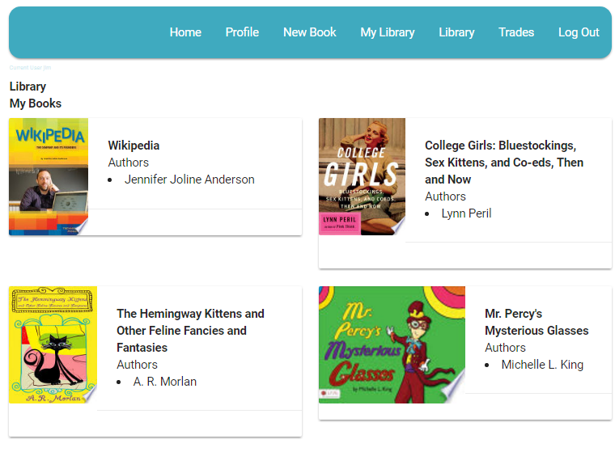

# fcc-bookswap-v2
Free Code Camp - Manage a Book Trading Club

## Purpose - Manage a Book Trading Club
https://www.freecodecamp.org/challenges/manage-a-book-trading-club

## Here are the specific user stories you should implement for this project

User Story: I can view all books posted by every user.

User Story: I can add a new book.

User Story: I can update my settings to store my full name, city, and state.

User Story: I can propose a trade and wait for the other user to accept the trade.

### This project requires
MongoDB installed and running

Node installed

#### In a command prompt browse to the root of the folder run 

npm install

npm install -g bower

bower install